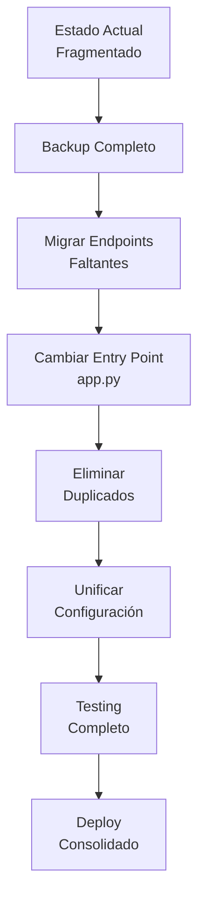

# 📚 ÍNDICE DE DOCUMENTACIÓN - RED SOLUCIONES ISP

## 📋 DOCUMENTOS CREADOS PARA CONSOLIDACIÓN

### **1. 📊 DOCUMENTACION_ESTADO_ACTUAL.md**
**Propósito:** Análisis completo del estado actual del proyecto  
**Contenido:**
- Arquitectura actual completa
- Problemas críticos identificados
- Análisis de componentes
- Estado de integración de servicios
- Archivos críticos documentados

**Cuándo usar:** Para entender el proyecto antes de hacer cambios

---

### **2. 🚀 PLAN_CONSOLIDACION.md**
**Propósito:** Estrategia completa de consolidación  
**Contenido:**
- 6 fases de consolidación detalladas
- Estructura objetivo del proyecto
- Scripts de consolidación
- Métricas antes/después
- Criterios de éxito
- Cronograma estimado

**Cuándo usar:** Como guía estratégica para la consolidación

---

### **3. 🔧 HOJA_RUTA_TECNICA.md**
**Propósito:** Pasos técnicos específicos paso a paso  
**Contenido:**
- Checklist detallado de ejecución
- Código específico para migrar
- Orden crítico de ejecución
- Checkpoints de validación
- Puntos de no retorno
- Métricas de validación

**Cuándo usar:** Durante la ejecución técnica de cambios

---

### **4. 🔍 MAPEO_DEPENDENCIAS.md**
**Propósito:** Análisis detallado de todas las dependencias  
**Contenido:**
- Matriz completa de dependencias
- Análisis archivo por archivo
- Conflictos críticos identificados
- Flujo de datos actual
- Archivos seguros para eliminar
- Orden seguro de consolidación

**Cuándo usar:** Para entender cómo están conectados los componentes

---

### **5. 🚀 SCRIPT_CONSOLIDACION.md**
**Propósito:** Comandos automatizados y modificaciones manuales  
**Contenido:**
- Scripts bash automatizados
- Comandos de verificación
- Modificaciones manuales requeridas
- Testing automatizado
- Comandos de emergencia/rollback
- Checklist final

**Cuándo usar:** Durante la ejecución práctica de la consolidación

---

## 🎯 ORDEN DE LECTURA RECOMENDADO

### **Para Entender el Proyecto:**
1. **DOCUMENTACION_ESTADO_ACTUAL.md** - Lee primero para entender qué tienes
2. **MAPEO_DEPENDENCIAS.md** - Entiende cómo está conectado todo

### **Para Planificar Cambios:**
3. **PLAN_CONSOLIDACION.md** - Estrategia general
4. **HOJA_RUTA_TECNICA.md** - Pasos específicos

### **Para Ejecutar:**
5. **SCRIPT_CONSOLIDACION.md** - Comandos y ejecución práctica

---

## 🚨 INFORMACIÓN CRÍTICA EXTRAÍDA

### **PROBLEMAS PRINCIPALES IDENTIFICADOS:**
1. ❌ **Endpoint `/api/dashboard` faltante** - Frontend lo llama pero no existe
2. ❌ **Archivos duplicados** - dashboard.html = index.html (exactos)
3. ❌ **Dos APIs paralelas** - api/index.py vs backend/app/main.py
4. ❌ **Entry point incorrecto** - app.py apunta a API incompleta
5. ❌ **Configuración fragmentada** - Múltiples sistemas de config

### **SOLUCIONES PRIORIZADAS:**
1. ✅ **Migrar endpoint faltante** a backend/app/main.py
2. ✅ **Cambiar entry point** de api/index.py → backend/app/main.py
3. ✅ **Eliminar duplicados** seguros (dashboard.html, etc.)
4. ✅ **Unificar configuración** en un solo sistema
5. ✅ **Testing completo** para validar cambios

---

## 📊 MÉTRICAS DEL PROYECTO

### **Estado Actual:**
- **Archivos duplicados:** 4+ identificados
- **APIs paralelas:** 2 (conflictivas)
- **Endpoints rotos:** `/api/dashboard` (404)
- **Líneas de código duplicado:** ~1,500+
- **Configuraciones:** 3 sistemas diferentes

### **Objetivo Post-Consolidación:**
- **Archivos duplicados:** 0
- **APIs:** 1 unificada y robusta
- **Endpoints rotos:** 0
- **Líneas duplicadas:** 0
- **Configuración:** 1 sistema unificado

---

## 🔄 FLUJO DE CONSOLIDACIÓN

---

## ⚠️ ADVERTENCIAS CRÍTICAS

### **ANTES DE EMPEZAR:**
1. 🚨 **BACKUP OBLIGATORIO** - Sin excepción
2. 🚨 **Leer toda la documentación** antes de ejecutar
3. 🚨 **Seguir orden exacto** de pasos
4. 🚨 **No saltar checkpoints** de validación

### **DURANTE EJECUCIÓN:**
1. ⚠️ **Verificar cada paso** antes del siguiente
2. ⚠️ **No eliminar archivos** hasta confirmar migración exitosa
3. ⚠️ **Probar endpoints** después de cada cambio
4. ⚠️ **Tener plan de rollback** listo

### **SEÑALES DE PROBLEMAS:**
- 🔴 Error 404 en `/api/dashboard` después de cambios
- 🔴 Frontend no carga o muestra errores
- 🔴 Errores 500 en cualquier endpoint
- 🔴 Logs muestran errores de importación

**Acción:** Inmediato rollback desde backup

---

## 🎯 RESULTADOS ESPERADOS

### **Después de Consolidación Exitosa:**
- ✅ Frontend carga sin errores
- ✅ Todos los endpoints responden correctamente
- ✅ Dashboard muestra datos reales desde Google Sheets
- ✅ Chat IA funciona con Smart Agent
- ✅ Panel de administración operativo
- ✅ No hay archivos duplicados
- ✅ Configuración unificada y robusta
- ✅ Sistema listo para mantenimiento y escalabilidad

### **Beneficios a Largo Plazo:**
- 🚀 **Mantenibilidad:** Código limpio sin duplicaciones
- 🚀 **Robustez:** Error handling avanzado
- 🚀 **Escalabilidad:** Arquitectura consolidada
- 🚀 **Rendimiento:** Servicios optimizados
- 🚀 **Desarrollo:** Estructura clara para nuevas features

---

## 📞 SOPORTE Y TROUBLESHOOTING

### **Si Algo Sale Mal:**
1. **STOP** - No continuar
2. **Consultar** MAPEO_DEPENDENCIAS.md para entender el problema
3. **Ejecutar** comandos de verificación en SCRIPT_CONSOLIDACION.md
4. **Si persiste:** Rollback completo desde backup
5. **Revisar** logs y documentación antes de reintentar

### **Recursos de Ayuda:**
- **Para problemas técnicos:** HOJA_RUTA_TECNICA.md
- **Para entender dependencias:** MAPEO_DEPENDENCIAS.md
- **Para comandos específicos:** SCRIPT_CONSOLIDACION.md
- **Para rollback:** Sección de emergencia en cualquier documento

---

**📅 Documentación completada:** 24 de julio de 2025  
**🎯 Estado:** Lista para consolidación  
**📚 Total de páginas:** 5 documentos técnicos completos  
**⚡ Tiempo estimado de ejecución:** 2-4 horas (incluyendo testing)  
**🛡️ Nivel de riesgo:** Bajo (con backup y seguimiento de pasos)
