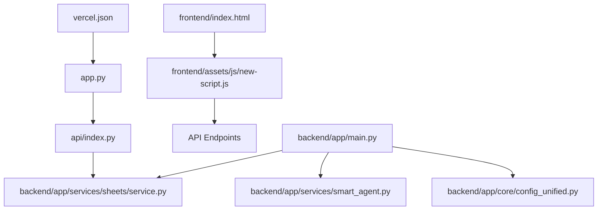

# 🔍 MAPEO COMPLETO DE DEPENDENCIAS

## 📊 MATRIZ DE DEPENDENCIAS

### **ARCHIVOS PRINCIPALES Y SUS CONEXIONES:**



### **DEPENDENCIAS CRÍTICAS IDENTIFICADAS:**

#### **1. ENTRY POINT CHAIN:**
```
vercel.json → app.py → api/index.py → SheetsServiceV2
```

#### **2. FRONTEND → BACKEND:**
```
index.html → new-script.js → fetch('/api/*') → api/index.py endpoints
```

#### **3. CONFIGURACIÓN:**
```
api/index.py: Hardcoded configs
backend/app/main.py: config_unified.py
```

---

## 📁 ANÁLISIS ARCHIVO POR ARCHIVO

### **A) ARCHIVOS DE ENTRADA (Entry Points)**

#### **vercel.json**
```json
{
  "builds": [{"src": "app.py", "use": "@vercel/python"}],
  "routes": [{"src": "/(.*)", "dest": "/app.py"}]
}
```
**Dependencias:**
- ➡️ Apunta a `app.py`
- ⚠️ **CRÍTICO:** Cambio aquí afecta todo el deploy

#### **app.py**
```python
from api.index import app  # ⚠️ CRÍTICO: Import principal
```
**Dependencias:**
- ➡️ Importa `api.index.app`
- ⚠️ **CAMBIO REQUERIDO:** Debe apuntar a `backend.app.main.app`

---

### **B) APIs PRINCIPALES**

#### **api/index.py** (ACTUAL EN PRODUCCIÓN)
**Líneas:** 462
**Funciones críticas:**
```python
# Frontend routes
@app.get("/")                    # Sirve index.html
@app.mount("/assets", ...)       # Sirve assets estáticos

# API endpoints  
@app.get("/api/clients")         # ✅ Usado por frontend
@app.post("/api/clients")        # ✅ Usado por frontend
@app.get("/api/prospects")       # ✅ Usado por frontend
@app.post("/api/chat")           # ✅ Usado por frontend

# ❌ FALTA: /api/dashboard (requerido por frontend)
```

**Dependencias:**
- ➡️ `backend.app.services.sheets.service.SheetsServiceV2`
- ➡️ `frontend/` directory para static files
- ⚠️ **PROBLEMA:** Configuración hardcoded

#### **backend/app/main.py** (NO USADO ACTUALMENTE)
**Líneas:** 731
**Funciones avanzadas:**
```python
# Configuración robusta
from backend.app.core.config import settings
from backend.app.services.smart_agent import SmartISPAgent

# Endpoints avanzados
@app.get("/api/dashboard/kpis")     # ✅ Más robusto
@app.get("/api/clients/search/{query}")  # ✅ Búsqueda avanzada
@app.post("/api/chat")              # ✅ Con Smart Agent
```

**Dependencias:**
- ➡️ `backend.app.services.sheets.service.SheetsService`
- ➡️ `backend.app.services.smart_agent.SmartISPAgent`
- ➡️ `backend.app.core.config_unified.settings`
- ➡️ `backend.app.core.error_handlers`

---

### **C) FRONTEND**

#### **frontend/index.html**
**Líneas:** ~1,400
**Dependencias:**
```html
<!-- CSS -->
<link href="https://cdnjs.cloudflare.com/ajax/libs/font-awesome/6.0.0/css/all.min.css">
<!-- No CSS local referenciado -->

<!-- JavaScript -->
<!-- Script inline, no referencias externas -->
```

**Llamadas API críticas:**
```javascript
// ❌ PROBLEMA: Este endpoint NO existe en api/index.py
fetch('/api/clients')           // ✅ Existe
fetch('/api/prospects')         // ✅ Existe  
fetch('/api/chat')              // ✅ Existe
```

#### **frontend/dashboard.html**
**Estado:** ❌ **DUPLICADO EXACTO** de index.html
**Acción:** Eliminar completamente

#### **frontend/admin.html**
**Líneas:** ~450
**Dependencias:**
```html
<link rel="stylesheet" href="assets/css/new-style.css">
<script src="assets/js/new-script.js"></script>
```

**Llamadas API:**
```javascript
fetch('/api/clients')           # ✅ Funciona
fetch('/api/dashboard/kpis')    # ❌ Solo existe en backend/app/main.py
```

#### **frontend/assets/js/new-script.js**
**Líneas:** 521
**Configuración API:**
```javascript
const API_BASE = '/api';  // ⚠️ Base para todas las llamadas
```

**Endpoints llamados:**
```javascript
// ❌ PROBLEMAS: Estos NO existen en api/index.py actual
fetch(`${API_BASE}/dashboard`)           // Línea 129
fetch(`${API_BASE}/clients?search=...`)  // Línea 384, 486
```

---

### **D) SERVICIOS CORE**

#### **backend/app/services/sheets/service.py**
**Líneas:** 1,421
**Clase principal:** `SheetsServiceV2`
**Usado por:**
- ✅ `api/index.py` (como SheetsServiceV2)
- ✅ `backend/app/main.py` (como SheetsService)

**Configuración:**
```python
SHEET_ID = "1OZKZIpn6U1nCfrDM_yGmC6jKj6iLH_MQz814LjEBRMQ"
```

#### **backend/app/services/smart_agent.py**
**Usado por:**
- ✅ `backend/app/main.py` (completo)
- ❌ `api/index.py` (NO lo usa - chat básico)

---

### **E) CONFIGURACIÓN**

#### **backend/app/core/config.py** (BÁSICO)
**Usado por:** Algunos imports menores

#### **backend/app/core/config_unified.py** (AVANZADO)
**Usado por:** `backend/app/main.py`
**Contenido:**
```python
class Settings:
    PROJECT_NAME: str = "Red Soluciones ISP"
    VERSION: str = "2.0.0"
    BACKEND_CORS_ORIGINS: List[str] = [...]
    # Configuración completa y robusta
```

---

## 🚨 CONFLICTOS Y PROBLEMAS CRÍTICOS

### **1. ENDPOINT `/api/dashboard` FALTANTE**
```javascript
// frontend/assets/js/new-script.js línea 129
const response = await fetch(`${API_BASE}/dashboard`);  // ❌ 404 ERROR
```
**Solución:** Agregar endpoint en `backend/app/main.py`

### **2. IMPORT CONFLICT EN APP.PY**
```python
# app.py actual
from api.index import app  # ❌ API incompleta

# Necesario después de consolidación  
from backend.app.main import app  # ✅ API completa
```

### **3. DUPLICACIÓN DE CLASES SHEETS**
```python
# api/index.py
from backend.app.services.sheets.service import SheetsServiceV2

# backend/app/main.py  
from backend.app.services.sheets.service import SheetsServiceV2 as SheetsService
```
**Problema:** Misma clase, nombres diferentes

### **4. ARCHIVOS DUPLICADOS**
- `frontend/index.html` = `frontend/dashboard.html` (100% idénticos)
- `backend/app/core/config.py` vs `config_unified.py`
- `smart_agent.py` vs `modern_agent_v2.py`

---

## 🔄 FLUJO DE DATOS ACTUAL

### **Request Flow en Producción:**
```
1. Usuario → frontend/index.html
2. index.html → assets/js/new-script.js  
3. new-script.js → fetch('/api/dashboard') → ❌ 404 ERROR
4. new-script.js → fetch('/api/clients') → ✅ api/index.py
5. api/index.py → SheetsServiceV2 → Google Sheets
6. Google Sheets → JSON Response → Frontend
```

### **Problema en el Flujo:**
- ❌ Paso 3 falla porque `/api/dashboard` no existe
- ⚠️ Frontend muestra datos mock o errores

---

## 📋 DEPENDENCIAS PARA ELIMINAR

### **Archivos Seguros de Eliminar:**
```bash
# ✅ SEGUROS (después de migración exitosa):
rm frontend/dashboard.html              # Duplicado exacto
rm api/simple_index.py                 # No usado
rm backend/app/services/modern_agent_v2.py  # Duplicado
rm requirements-simple.txt             # No usado

# ⚠️ DESPUÉS DE VERIFICAR NO HAY REFERENCIAS:
rm api/index.py                        # Después de migrar a main.py
rm backend/app/core/config.py          # Usar solo config_unified.py
```

### **Referencias a Verificar Antes de Eliminar:**
```bash
# Verificar que NO HAY imports o referencias:
grep -r "dashboard.html" .
grep -r "simple_index" .
grep -r "modern_agent_v2" .
grep -r "api.index" .
grep -r "config.py" backend/
```

---

## 🎯 ORDEN DE CONSOLIDACIÓN SEGURO

### **Secuencia Sin Romper Dependencias:**
1. ✅ **Migrar endpoints** faltantes a `backend/app/main.py`
2. ✅ **Probar endpoints** migrados funcionan
3. ✅ **Actualizar app.py** import
4. ✅ **Probar frontend** completo funciona
5. ✅ **Eliminar duplicados** seguros
6. ✅ **Unificar configuración**
7. ✅ **Testing final** y deploy

### **Rollback Plan:**
Si algo falla en cualquier paso:
```bash
# Restaurar desde backup
cp -r ../totton_backup_* .
```

---

**📅 Análisis completado:** 24 de julio de 2025  
**🎯 Estado:** Dependencias mapeadas y consolidación lista  
**⚠️ Crítico:** Seguir orden exacto para evitar romper el sistema
